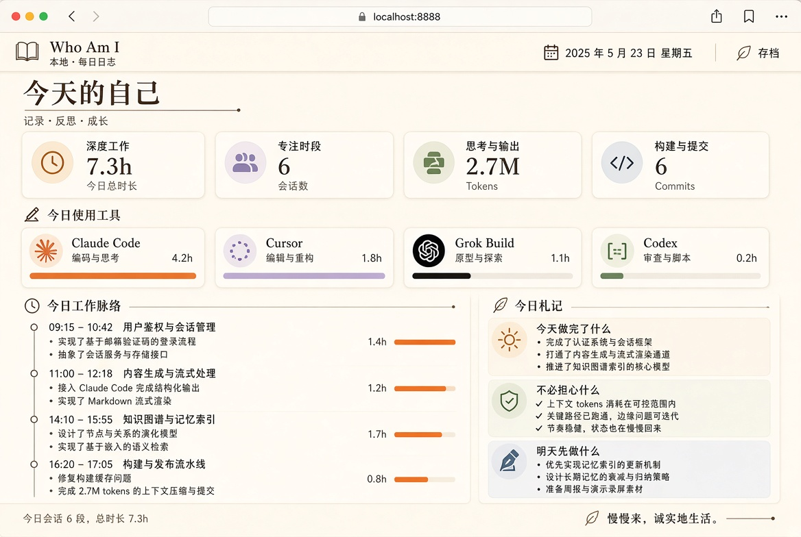

# Who Am I？

**看清自己每天在做什么。不必焦虑。知道自己到底有没有为之努力。**

官网：[who-am-i.vercel.app](https://who-am-i.vercel.app)（GitHub Pages 镜像：[lniosy.github.io/who-am-i](https://lniosy.github.io/who-am-i/)）

Who Am I 是一个 **local-first** 的开源自我认知工具。它读取你电脑上已经存在的 AI 编程工具痕迹（Grok Build、Cursor、Codex、Claude Code），再加上 Git 提交，在每天结束时写成一份人话日报：

- 今天做完了什么
- 留下了哪些痕迹（打开过 ≠ 做完了）
- 不必担心什么
- 明天先做什么
- 这些事和你想成为的人、正在追的目标对齐吗

它不是又一块 token 看板。  
[aiusage](https://github.com/juliantanx/aiusage)、[ccusage](https://ccusage.com/)、[vibe-coding-tracker](https://github.com/Mai0313/VibeCodingTracker) 已经把用量统计做得很好。Who Am I 站在它们上面一层：**把用量翻译成自我理解。**

运行时是 TypeScript（Bun）。日报面板是独立的 Tauri 窗口，也可以用浏览器打开同一套页面。

---

## 为什么要做这个

用 AI 工具工作的人很容易陷入两种相反的焦虑：

1. **我烧了很多 token，但说不清今天到底做成了什么。**
2. **我没怎么打开工具，于是觉得自己荒废了一天。**

两者都把「工具活跃度」误当成「自我价值」。  
Who Am I 把证据、目标和叙述分开：

| 层 | 问题 | 数据从哪来 |
| --- | --- | --- |
| 事实 | 用了哪些工具、多久、哪些项目、提交了什么 | 本机会话日志、Git |
| 身份 | 我想要什么、正在追什么、明确不做什么 | 你写的 `identity.yaml` |
| 叙述 | 今天如何理解自己 | 本地规则模板，或你自己的模型 |

默认情况下，**提示词全文、源码、密钥都不会离开这台电脑。** 只有你主动配置了 LLM 接口，才会把「摘要后的事实 + 自我说明书」发去生成更顺的日报。

---

## 现在能读哪些工具

| 工具 | 本机来源 | 能拿到什么 |
| --- | --- | --- |
| Claude Code | `~/.claude/projects/**/*.jsonl` | 会话、时间窗、token、用户意图摘要、触及的文件 |
| Codex | `~/.codex/sessions/**/*.jsonl` | 同上；项目名来自会话里的 cwd，不是日期文件夹 |
| Grok Build | `~/.grok/sessions/<项目>/<会话>/summary.json` + `updates.jsonl` | 标题、时间戳、累计 token、用户原话 |
| Cursor | `~/.cursor/chats/**/meta.json`、`~/.cursor/ai-tracking/ai-code-tracking.db` | 会话与改动痕迹（官方个人用量 API 仍有限） |
| Git | 说明书里登记的仓库 / 当前目录 | 提交数、说明、增删行 |

采集器是插件式的。读不到的工具会静默跳过，警告会写进面板，不会把一天搞砸。

时长按时间戳聚类（中间大段发呆会切开）。多工具并行时，面板上的总时长只计一次。

---

## 快速开始

需要 [Bun](https://bun.sh)。桌面窗口另外需要 Rust（第一次 `bun run app` 时 Tauri 会用到）。

```bash
git clone https://github.com/Lniosy/who-am-i.git
cd who-am-i
bun install

bun run wai init
$EDITOR "$(bun run wai paths | awk '/identity/{print $2}')"
bun run wai scan
bun run wai today
bun run wai serve          # 浏览器 http://127.0.0.1:8787
bun run app                # 独立日报窗口
```

也可以：

```bash
bun packages/cli/src/cli.ts today
```

日报写到本机数据目录（`bun run wai paths` 可查看），同时打印在终端。

面板第一次打开是**本机数据**。这一天还没生成过日报时，是空状态，不会拿示例日冒充你的一天。示例日在按钮里，用来看成品长什么样。



每晚自动跑一次：

```bash
# crontab -e
30 21 * * * $HOME/.bun/bin/bun /path/to/who-am-i/packages/cli/src/cli.ts today
```

---

## 自我说明书

`wai init` 之后编辑 `identity.yaml`。这是产品的核心，不是装饰。

```yaml
name: ""
north_star: "每天结束时，清楚自己做了什么、没做什么、明天先做什么。"

values:
  - 用证据说话，不靠感觉惩罚自己
  - Token 消耗不等于自我价值

goals:
  - id: this-season
    title: 把这一季最重要的那件事，做成能演示的最小版本
    why: 不想只在工具之间切换，却说不出作品是什么
    horizon: 90d
    status: active

not_doing:
  - 把工具用量榜当成人格排名
```

没有说明书，日报就只是日志。有了说明书，日报才回答「这是不是我想要的人生」。

---

## 用自己的模型写日报（可选）

编辑设置文件里的：

```yaml
llm_base_url: "http://127.0.0.1:11434/v1"   # 或 https://api.x.ai/v1
llm_api_key_env: WHOAMI_API_KEY
llm_model: "llama3.1"
```

发给模型的是结构化事实，不是仓库源码。不填则走内置规则模板，完全离线。

---

## 设计原则

1. **本机优先。** 默认可离线。云是可选项，不是前提。
2. **采集失败不能毁掉仪式。** 某一个工具的日志格式变了，其它部分仍要能出日报。
3. **降低焦虑，不制造羞耻。** 文案禁止「你今天不够努力」这种审判。
4. **证据与叙事分离。** token、时长是事实；「这意味着什么」才是产品。
5. **用户拥有对自己的定义。** 目标、价值观、不做什么，只能由本人写。

更完整的架构见 [docs/architecture.md](docs/architecture.md)。

---

## 路线图

- [x] Claude Code / Codex / Grok Build / Cursor / Git 采集器（按本机真实格式）
- [x] 本机说明书 + 规则日报 + 可选 LLM
- [x] CLI：`init` / `scan` / `today` / `who` / `serve`
- [x] 独立日报窗口（Tauri）
- [ ] 更稳的 Cursor 官方/非官方用量对接
- [ ] ActivityWatch 窗口标题（可选）
- [ ] 周报：这周有没有对准北极星
- [ ] 插件规范：第三方采集器
- [ ] 菜单栏托盘「现在在做什么」

---

## 和现有项目的关系

Who Am I **不打算**再实现一遍 20 个工具的 token 解析精度。欢迎直接复用 ccusage / aiusage 的解析结果作为事实层输入。本项目的差异化是：

- 身份（我想要什么）
- 对齐（我有没有在追它）
- 安放（什么可以今晚放下）
- 下一步（明天只带 3 件事）

如果你只想看花了多少钱，用那些工具。  
如果你想少一点自我攻击，用这个。

---

## 官网

静态页在 `site/`。正式站走 [Vercel](https://who-am-i.vercel.app)：用 GitHub 导入仓库即可，`vercel.json` 会把 `site/` 拷进发布目录。之后推 `main` 会自动发布。

GitHub Pages 仍作镜像。

## 贡献

见 [CONTRIBUTING.md](CONTRIBUTING.md)。新采集器、更温和的文案、本地 UI，都需要人。

## 许可

MIT
